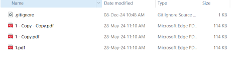

# PDF Merger

*Merge pdf files script in python.*

## Running the code

### Prerequisites

- You need to install **PyPDF2** using pip: *pip install PyPDF2*
- Place the files inside **to_merge** folder.
- Run the script **python pdf_merger.py** using Python.
- Merged file will be inside **merged** folder, with timestamp in it's name.

### *Locations*

Input pdf files in the to_merge folder.

Output pdf files in the merged folder.
